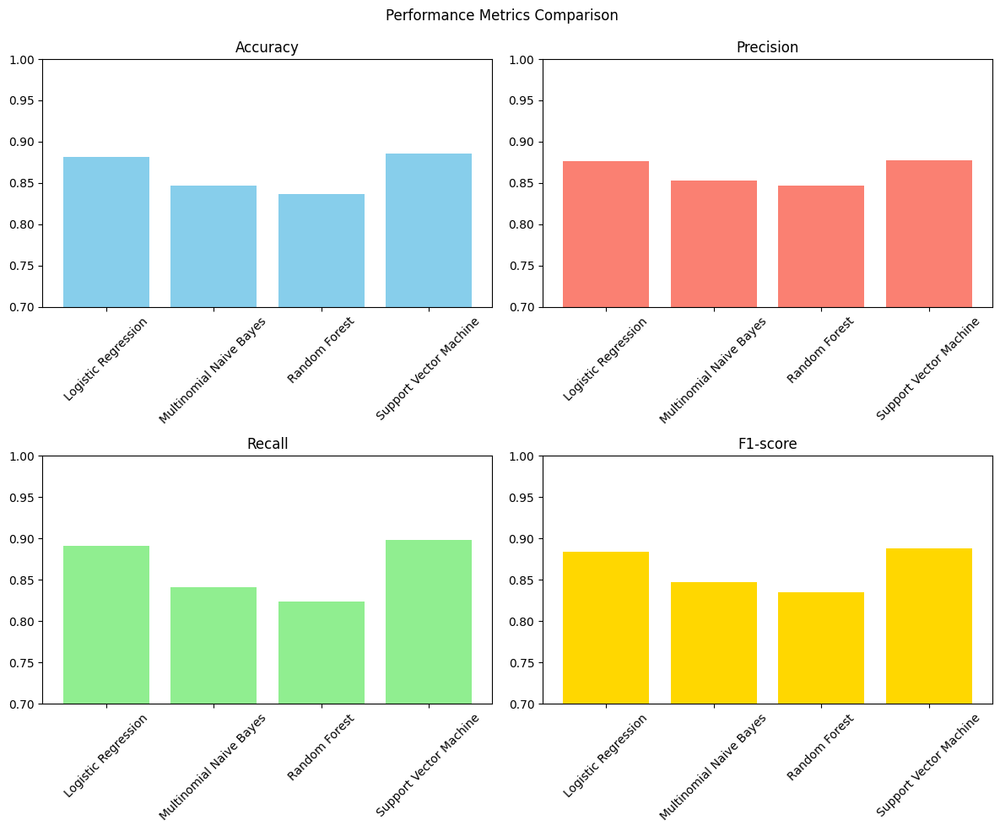
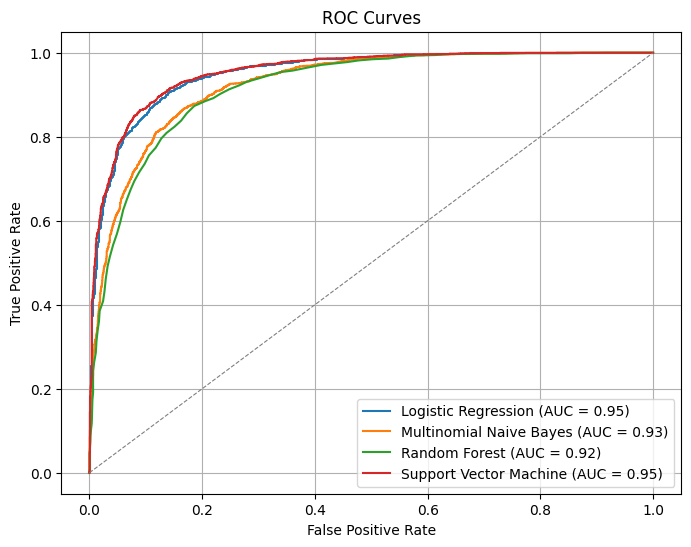

# Movie Review Sentiment Analysis in NLP

This project demonstrates sentiment analysis on the Large Movie Review Dataset using Natural Language Processing (NLP) techniques. It includes data preprocessing, model training, and evaluation of four different machine learning algorithms: Logistic Regression, Multinomial Naive Bayes, Random Forest, and Support Vector Machine.

## Dataset

The Large Movie Review Dataset contains:
- 25,000 positive and 25,000 negative labeled reviews for training and testing.
- An additional set of 50,000 unlabeled reviews for unsupervised learning.
You can download the dataset from the following link:
[Large Movie Review Dataset](https://ai.stanford.edu/~amaas/data/sentiment/)

## Usage

To use the dataset, please cite the following ACL 2011 paper:

> @inproceedings{maas-EtAl:2011:ACL-HLT2011,
> author = {Maas, Andrew L. and Daly, Raymond E. and Pham, Peter T. and Huang, Dan and Ng, Andrew Y. and Potts, Christopher},
> title = {Learning Word Vectors for Sentiment Analysis},
> booktitle = {Proceedings of the 49th Annual Meeting of the Association for Computational Linguistics: Human Language Technologies},
> month = {June},
> year = {2011},
> address = {Portland, Oregon, USA},
> publisher = {Association for Computational Linguistics},
> pages = {142--150},
> url = {http://www.aclweb.org/anthology/P11-1015}
> }

## Project Steps

### 1. Data Preprocessing

- **Extracting and Loading the Dataset**: The dataset is extracted and loaded into pandas DataFrames.
- **Cleaning the Text**: The text is cleaned by removing non-alphanumeric characters, URLs, and punctuation.
- **Removing Stop Words**: Common stop words are removed to reduce noise in the data.
- **Lemmatization**: Reduces words to their base or dictionary form, considering the context (e.g., "better" becomes "good").
- **Stemming**: Reduces words to their base or root form by removing suffixes (e.g., "running" becomes "run").
- **Tokenization**: Splits text into individual words or tokens (e.g., "The cat sat on the mat" becomes ["The", "cat", "sat", "on", "the", "mat"]).

### 2. Model Training

Four different machine learning algorithms are trained using TF-IDF vectorized features:

- **Logistic Regression**
- **Multinomial Naive Bayes**
- **Random Forest**
- **Support Vector Machine**

### 3. Model Evaluation

The models are evaluated using the following metrics:
- Accuracy
- Precision
- Recall
- F1-score
- ROC-AUC

### 4. Visualization

The results are visualized using bar charts and ROC curves.

## Performance Metrics

| Model                    | Accuracy | Precision | Recall | F1-score | ROC-AUC |
|--------------------------|----------|-----------|--------|----------|---------|
| Logistic Regression      | 0.8816   | 0.8760    | 0.8907 | 0.8833   | 0.9509  |
| Multinomial Naive Bayes  | 0.8472   | 0.8529    | 0.8414 | 0.8471   | 0.9254  |
| Random Forest            | 0.8364   | 0.8468    | 0.8239 | 0.8351   | 0.9183  |
| Support Vector Machine   | 0.8854   | 0.8772    | 0.8978 | 0.8874   | 0.9544  |

## Visualizations

### Performance Metrics Comparison

### ROC Curves

## Conclusion

This project demonstrates how to apply and compare different machine learning algorithms for sentiment analysis using the Large Movie Review Dataset. The results show that the Support Vector Machine model achieved the highest accuracy and ROC-AUC score.

## License

This project is licensed under the MIT License.

